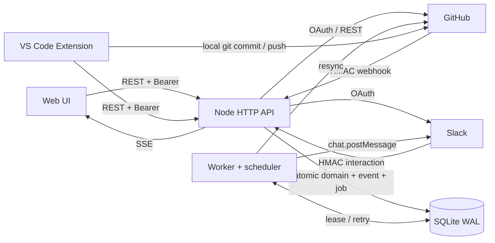
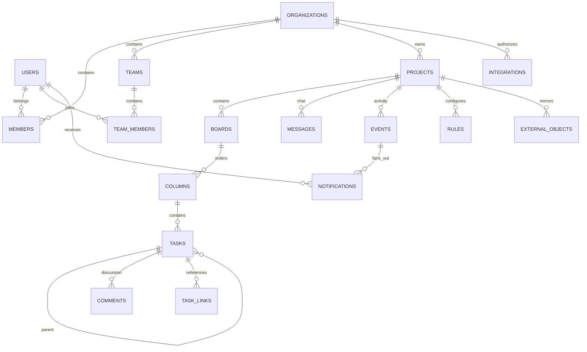
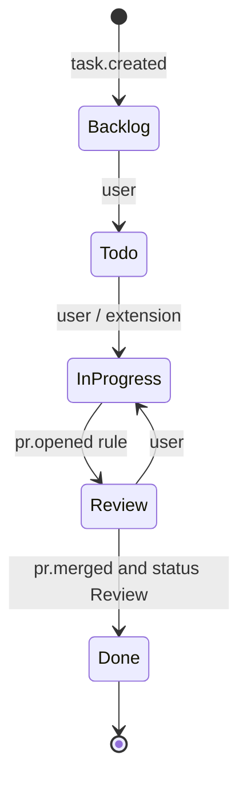
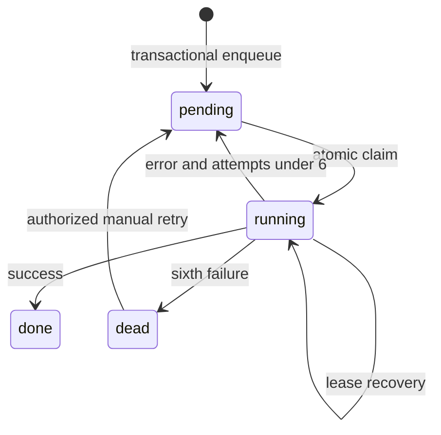

# Mimari

Modüler monolit ve ayrı worker seçimi, PoC'de dağıtık transaction sorununu azaltır. API yanıt vermeden domain değişikliğini, event'i, audit'i ve worker işini tek SQLite transaction'ında yazar. Harici HTTP çağrıları DB transaction dışında yapılır.



## Veri modeli



DDL: `src/schema.sql`. İlk açılışta `CREATE TABLE IF NOT EXISTS` ile uygulanır; sürümlü migration runner yoktur. Mevcut bir şemayı değiştirmek için ileride migration eklenmelidir. Task ID global monotonic integer'dır (`TASK-142`), dış referanslar projeye göre filtrelenir. Global ID tahmin edilebilse de tenant erişimi ayrıca zorunludur.

## Event sözleşmesi

```json
{
  "id": 142,
  "event_key": "github:project-uuid:pr:74:2026-09-20T12:00:00Z:pr.merged:1",
  "project_id": "project-uuid",
  "task_id": 1,
  "source": "github",
  "type": "pr.merged",
  "actor": null,
  "payload": "{\"kind\":\"pr\",\"external_id\":\"74\"}",
  "created_at": 1790000000000
}
```

`payload` SQLite'da JSON metnidir; API activity/event yanıtlarında da JSON string olarak döner. `actor` platform kullanıcı UUID'sidir; GitHub/scheduler/system için null olabilir. `source`: platform, github, slack, automation veya scheduler. `id` local append sırasıdır; GitHub'ın global nedensellik sırası değildir.

Başlıca eventler: `task.created`, `task.assigned`, `task.updated`, `task.status_changed`, `task.comment`, `task.linked`, `task.deleted`, `task.deadline`, `message.created`, `pr.opened`, `pr.closed`, `pr.merged`, `commit.updated`, `issue.updated`, `review.updated`, `ci.failed`, `ci.updated`, `release.created`, `github.action`.

## Task state machine



Bu diyagram demo akışıdır; `InProgress` görünen adı `In Progress`tır. Kolonlar DB üzerinden özelleşir, API task PATCH ile mevcut bir kolona geçiş yapılabilir. `version` eşleşmeyen task güncellemesi 409 döner. Kullanıcı gerekirse Done task'ı yeniden açabilir. Gecikmiş `pr.opened` automation'ı Done task'ı geri açamaz.

Default rule'lar proje oluşturulunca DB'ye yazılır. `trigger`, opsiyonel `condition_status`, `action` ve `value` alanları vardır. PR açılış webhook'u tamamen kaçırılmışsa `pr.merged` için ek `In Progress → Done` kuralı resync sırasında toparlanmayı sağlar. Backlog/Todo task'lar otomatik tamamlanmaz. Desteklenen aksiyonlar `set_status`, `comment`, `slack`. Automation kaynaklı eventlerden tekrar status/comment automation çalıştırılmaz; döngü sınırlanır. Birden fazla birbiriyle çelişen kural tanımlamayın; öncelik/conflict çözümü yoktur.

## Worker / queue



- `BEGIN IMMEDIATE` ile bir due job seçilir; 60 saniyelik lease ve attempt artışı transaction içinde yazılır. 20 saniyede bir lease heartbeat yenilenir.
- Github webhook işleme ve event fanout'ı, job `done` işaretiyle aynı transaction'dadır. Ortada crash olursa tüm domain etkileri rollback olur.
- Slack/resync HTTP sırasında transaction tutulmaz. API fetch timeout 15 saniyedir.
- Hata: exponential backoff `min(300000,1000*2^attempt)` + jitter. `Retry-After` veya GitHub rate reset daha geçse o zamana ertelenir. Altı başarısız deneme → dead-letter; hata metni ve attempt sayısı tutulur. 401/403 gibi kalıcı hatalar da PoC'de aynı deneme bütçesini tüketir.
- En az bir kez yürütme semantiği. Tek worker önerilir; birden fazla worker için lease fencing, entity-partitioned queue ve provider bazlı rate limiter eklenmelidir.
- Scheduler dakikada bir deadline tarar ve beş dakikalık zaman dilimi başına bir resync job'ı oluşturur. Kesinti sonrası bir sonraki tarama kalıcı durumu toparlar.

## Idempotency ve ordering

| Katman | Anahtar / davranış |
|---|---|
| API local mutasyon | `(user_id, Idempotency-Key)` ve request hash; aynı body aynı yanıt, farklı body 409 |
| GitHub delivery | Unique job key `github:{X-GitHub-Delivery}` |
| External object | `(project_id, kind, external_id)` upsert |
| External ordering | `updated_at` eskiyse ignore; merged PR terminal koruması |
| Task link | `(task_id, kind, external_id)` unique |
| Domain event | Semantic provider/object/timestamp/type/task key unique |
| Notification | `(event_id, user_id)` unique |
| Slack action | İmzalı form body hash'i ve side effect aynı transaction |
| Deadline | `deadline:{task_id}:{due_date}` unique event |

GitHub PR/commit senkronizasyonu webhook ve resync arasında ortak ingest fonksiyonunu kullanır. Event key üzerinde delivery UUID kullanılmaması aynı provider durumunun farklı delivery'lerle tekrar bildirim üretmesini önler. Farklı payload şekilleri veya aynı timestamp'li değişikliklerin tam nedensellik çözümü PoC sınırıdır. Check/review ile PR bağlantısı task linkleri ve head commit SHA üzerinden kurulur.

API idempotency senkron yerel route'larda uygulanır. OAuth callback, repository doğrulaması ve GitHub outbound aksiyonları async route olduğundan bu garantiye dahil değildir. Silinen görev için eski idempotent create yanıtı dönmesi standart retry semantiğidir; yeni oluşturma için yeni key kullanın.

## Permission modeli

| İşlem | Owner | Admin | Member | Viewer |
|---|---|---|---|---|
| Org/proje/task/chat/feed okuma | ✓ | ✓ | ✓ | ✓ |
| Task, yorum, mesaj, kolon, proje oluşturma | ✓ | ✓ | ✓ | — |
| Entegrasyon, automation, audit, job yönetimi | ✓ | ✓ | — | — |
| Repo aksiyonu (merge hariç) | ✓ | ✓ | ✓ | — |
| PR merge | ✓ | ✓ | — | — |
| Admin rolü verme | ✓ | — | — | — |

Her proje erişiminde org üyeliği kontrol edilir. Task, parent, kolon, reply ve mention referansları proje/org sınırında doğrulanır. SSE her heartbeat'te session/üyelik kontrolünü tekrarlar. Notification okuma, sahipliği ve güncel org üyeliğini gözetir. Owner değişimi/silinmesi uygulanmaz. Teams organizasyon içinde gruplamadır; authorization kaynağı değildir.

Parolalar rastgele salt ile scrypt kullanır. Bearer session tokeni 7 gün geçerli, DB'de SHA-256 hash halinde tutulur. Web istemcisi sessionStorage, extension SecretStorage kullanır. Cookie auth olmadığı için mutasyonlar ambient cookie üzerinden yetki almaz. OAuth state tek kullanımlık, 10 dakika süreli, kullanıcı/org/provider'a bağlıdır. Webhook HMAC karşılaştırması constant-time yapılır, Slack timestamp toleransı 5 dakikadır.

## Büyüme yolu

1. SQLite → PostgreSQL, gerçek migration runner, composite tenant foreign key ve Row Level Security.
2. Aynı transactional outbox sözleşmesini koruyarak worker'ı PostgreSQL `SKIP LOCKED` veya message broker'a taşıma; entity partitioning ve fencing.
3. GitHub App installation tokenleri, dar izinler, provider başına rate-limit bütçesi, incremental resync cursor, tombstone reconciliation.
4. Outbound GitHub komutları için kalıcı command log, provider durumuyla sonuç doğrulama. Slack belirsiz teslimleri için reconciliation ve açık delivery status.
5. OIDC, proje ACL, ayrı kişisel entegrasyonlar, token rotation, audit export, retention, metrics/tracing, DLQ alarmı.
6. SSE event cursor'ını koruyarak fanout/pubsub; dosya tabanlı polling yerine broker broadcast.
